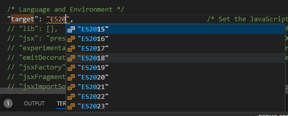
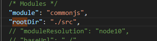
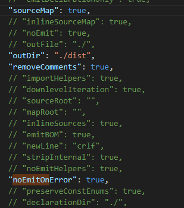
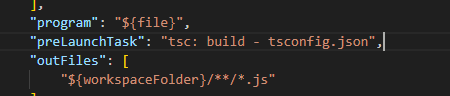

# TypeScript Study Notes

## Prerequisites
Before diving into TypeScript, it's helpful to be familiar with the following JavaScript concepts:
- **Variables**: Declaring and assigning values.
- **Arrays**: Working with collections of data.
- **Objects**: Creating and manipulating objects.
- **Functions**: Defining functions for code reuse.
- **Arrow Functions**: Compact syntax for function expressions.
- **Destructuring**: Extracting values from arrays and objects.

---

## Benefits of TypeScript
TypeScript provides several advantages over JavaScript that make it especially appealing for large projects and collaborative coding.

1. **Static Typing**
   - **Statically Typed**: TypeScript enforces types at compile time, allowing early detection of potential errors.
     ```bash
	    int number = 20;
		Number = ‘a’;  (Not allowed)
     ```
   - **Dynamically Typed (JavaScript)**: In JavaScript, type-related errors are often caught only at runtime, which can lead to unexpected behavior.
     ```bash
		Let number = 10;
		Number = “a”;
		Math.round(number);
     ```
2. **Code Completion and IntelliSense**: TypeScript's type system enables code editors to provide accurate suggestions, auto-completion, and error detection, making coding faster and less error-prone.
3. **Refactoring**: Types improve refactoring tools, allowing you to confidently change code structure without breaking functionality.
4. **Shorthand Notations**: TypeScript syntax often includes shorthands that make the code cleaner and easier to understand.

---

## Drawbacks
While TypeScript has many benefits, there are a few drawbacks:
- **Compilation Requirement**: TypeScript code needs to be compiled to JavaScript before running in a browser or server environment.
- **Coding Discipline**: TypeScript requires consistent typing and code structure, which might require more initial effort and planning.

---

## Setting up the TypeScript Environment
1. **Install Node.js** (TypeScript requires Node.js to run in development).
2. **Install TypeScript** globally using npm.
   ```bash
   npm I -g typescript
   ```
3. **Compile TypeScript Code**: Compile `.ts` files to JavaScript. This will generate a `.js` file that can be run (e.g., with Code Runner). By default, TypeScript compiles to ES5.
   ```bash
   tsc filename.ts
   ```

### TypeScript Compiler Configuration
To customize TypeScript settings:
1. **Initialize TypeScript Configuration** to create a `tsconfig.json` file.
   ```bash
   tsc –init (it creates a config file)
   ```
3. **Update `tsconfig.json`**: Modify configurations like `target` (JavaScript version), `strict` (strict mode), and other compiler options.
   <p align="center">
	
   </p>
   <p align="center">
	
   </p>
   <p align="center">
	
   </p>

---

## Debugging Setup (Optional)
To use debugging tools, create a `launch.json` file in your `.vscode` folder and configure it for TypeScript debugging.

<p align="center">
	
</p>

---

## JavaScript vs. TypeScript Types

| JavaScript Type | TypeScript Type |
|-----------------|-----------------|
| Number          | `number`        |
| String          | `string`        |
| Boolean         | `boolean`       |
| Null            | `null`          |
| Undefined       | `undefined`     |
| Object          | `object`, `any`, `unknown` |
| N/A             | `never`, `enum`, `tuple` |

---

## Type Handling in TypeScript

1. **Declaring Variables with Types**: TypeScript allows specifying types for variables, making the code more predictable.
   ```bash
   let sales: number = 123_456_789
   let des: string = “Azman Ahmed”
   let flag:boolean = true
   let anyvar: any = 1
   anyvar = "str"
   ///here variable anyvar is of any type
   ```

2. **Arrays**: TypeScript enforces consistent types in arrays, preventing unexpected types from being added.
   ```bash
   let arr[] = [1,2,”3”]
   let arr[]:number[] = [1,2,3]
   ```

3. **Tuples**: Tuples allow fixed structures with specific types for each element, adding structure to arrays of known values.
   ```bash
   let user: [string, number] = [‘Azman’, 1];
   ```
4. **Enums**: Enums define a set of named constants, making the code more readable and reducing the risk of misused values.
   ```bash
   const enum SizeShirt  {small = 1, medium, large}
   let mysize:SizeShirt = SizeShirt.large
   console.log(mysize)
   ```
---

## Functions
In TypeScript, you can define the types of function parameters and return types, adding clarity and reducing errors.
```bash
function calculateTax(income : number): number{
	return income*1.2;
}
```

Arguments type and return type

```bash
function multiply(value1: number, value2: number): number {
    return value1 * value2;
}
  
console.log(multiply(10, 5)); // Prints: 50
  
const myMultiply: (val1: number, val2: number) => number = multiply;
console.log(myMultiply(5, 2)); // Prints: 10
  
```


## Objects
Define object structures with type annotations to enforce shape and type consistency, making it easier to work with structured data.
```bash
let employee: { name: string; age: number } = {
    name: "Azman",
    age: 30,
};
```
### A complex object
```bash
let complex: { data: number[], amount: number , output: (all: boolean) => number[] } = 
{
    data: [100, 3,99, 10],
    amount: 12,
    output: function(all: boolean): number[] 
    {
      return this.data
    }
};
console.log(complex.amount);
```
### Optional Object Properties
```bash
const right: { name: string, age?: number } = {
    name: 'Robert'
};

const alsoRight: { name: string, age?: number } = {
    name: 'Robert',
    age: 24
};

// This is not possible because the name key-value pair is missing.
const wrong: { name: string, age?: number } = {
    age: 24
};

```

## Alias

To Create our own type we can use Alias

```bash
type Complex = { data: number[], output: (all: boolean) => number[] };

let complex2: Complex  = {
   data: [100, 3, 99, 10],
   output: function(all: boolean): number[] {
      return this.data
   }
};
```

## Array Destructuring

```bash
const testResults: number[] = [3.89, 2.99, 1.38];
const [result1, result2, result3] = testResults;
```

## Object Destructuring

```bash
const scientist: { firstName: string, experience: number } = {
   firstName: 'Robert',
   experience: 9000 };
const { firstName, experience } = scientist;
---


